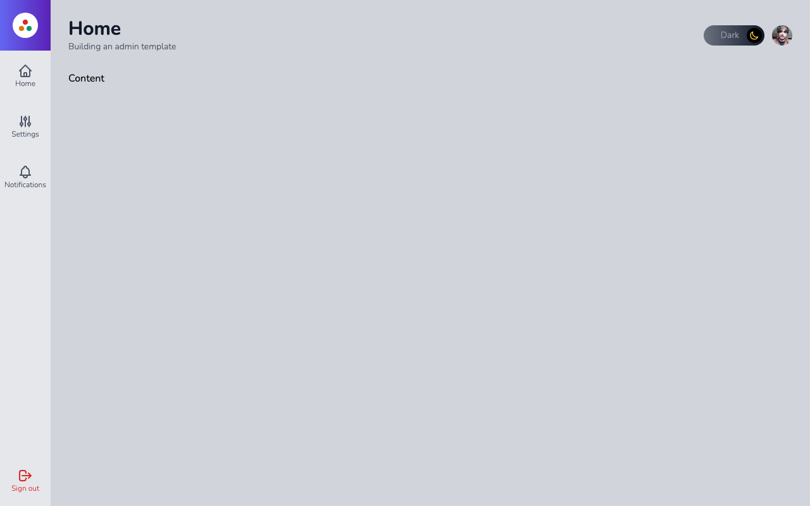
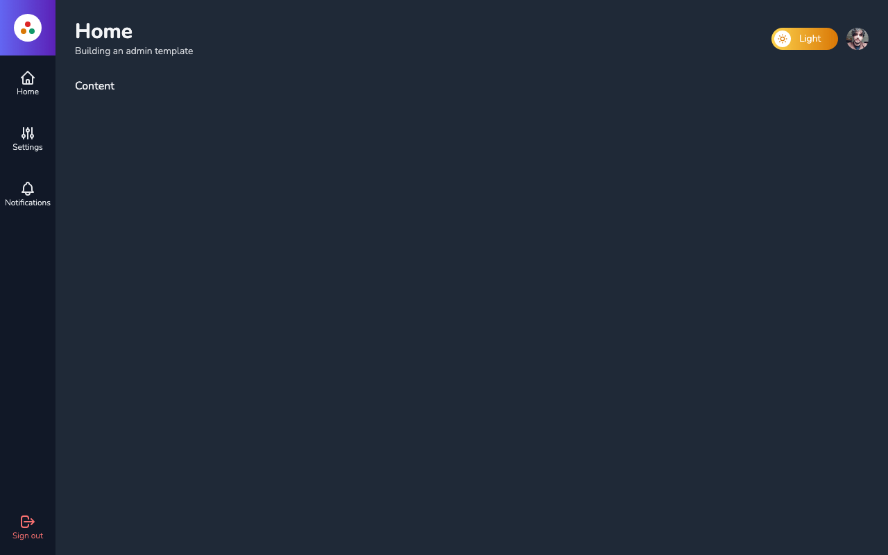

## Admin Template

Projeto/exercício parte do curso Next.js & React da Cod3r.\
Tecnologias utilizadas: Next.js, React, TypeScript, TailwindCSS, Firebase, Google Auth, localStorage, cookies.

## Getting Started

Depois de clonar o projeto, instale as dependências com `yarn` ou `npm`. E em seguida, execute o comando:

```bash
npm run dev
# ou
yarn dev
```

Abra a URL [http://localhost:3000](http://localhost:3000) no seu navegador.

## Telas





